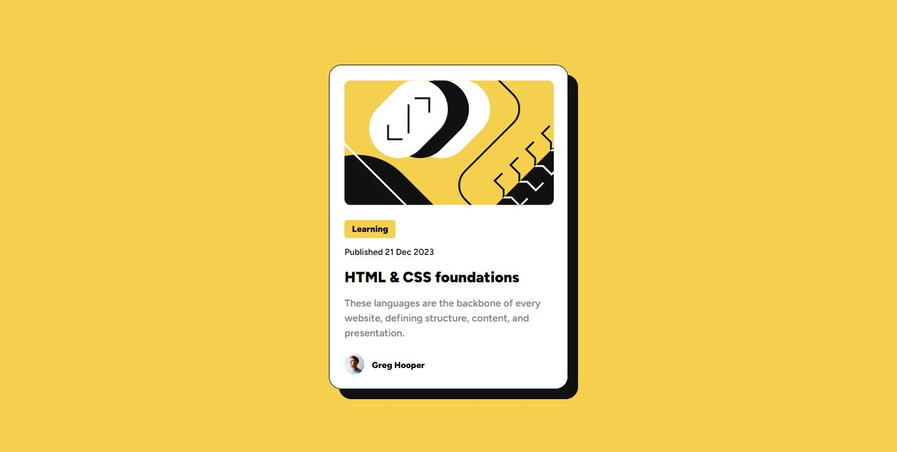

# Frontend Mentor - Blog preview card solution

This is a solution to the [Blog preview card challenge on Frontend Mentor](https://www.frontendmentor.io/challenges/blog-preview-card-ckPaj01IcS). Frontend Mentor challenges help you improve your coding skills by building realistic projects. 

## Table of contents

- [Overview](#overview)
  - [The challenge](#the-challenge)
  - [Screenshot](#screenshot)
  - [Links](#links)
- [My process](#my-process)
  - [Built with](#built-with)
  - [What I learned](#what-i-learned)
  - [Continued development](#continued-development)
  - [Useful resources](#useful-resources)
- [Author](#author)

## Overview

### The challenge

Users should be able to:

- See hover and focus states for all interactive elements on the page

### Screenshot

### Links

- Solution URL: [https://github.com/VH135/blog-preview-card](https://github.com/VH135/blog-preview-card)
- Live Site URL: [https://vh135.github.io/blog-preview-card](https://vh135.github.io/blog-preview-card/)

## My process

### Built with

- Semantic HTML5 markup
- SCSS custom properties
- Flexbox
- Pixel Perfect

### What I learned

It was a good challenge to refresh my knowledge of using hover effects and media queries to add a mobile version of the card.

Also I'm back to SCSS and it's awesome, my work with styles is more comfortable and effective now.

Pixel Perfect is a great tool to check how my work matches with the layout and I'm quite satisfied this time with the result.

### Continued development

Have plans to learn more about media queries and responsive design.

### Useful resources

- [W3 Schools Media queries](https://www.w3schools.com/css/css3_mediaqueries.asp) - There are basic info and simple working examples.
- [W3 Schools  Hover ](https://www.w3schools.com/cssref/sel_hover.php) - There is a good guide to refresh hover effect syntax.

## Author

- Website - [GitHub](https://github.com/VH135)
- Frontend Mentor - [@VH135](https://www.frontendmentor.io/profile/VH135)
- freeCodeCamp Forum - [Ray13](https://forum.freecodecamp.org/u/ray13/summary)
